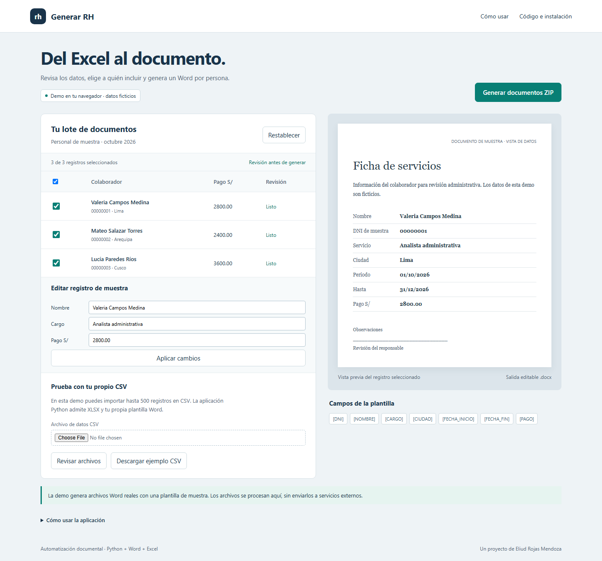
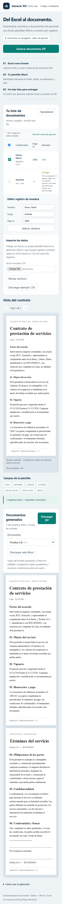
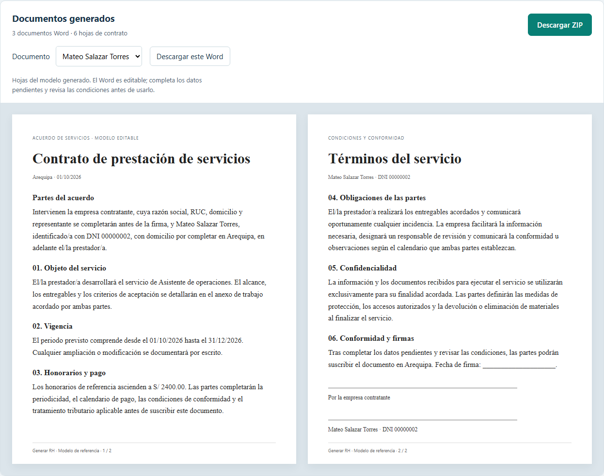

<div align="center">

# Generar RH

Documentos Word por lote a partir de datos tabulares y una plantilla, con revisión de filas antes de generar los archivos.

<a href="https://enybyy.github.io/rh-document-generator/"></a>

<p><a href="https://github.com/Enybyy"></a>
<a href="https://www.linkedin.com/in/eliud-rojas-mendoza-414652212/"></a>
<a href="https://www.upwork.com/freelancers/~01471ca462b236e8e5"></a></p>

[](https://enybyy.github.io/rh-document-generator/)

*Captura real de Generar RH con datos ficticios de ejemplo.*

[Acerca del proyecto](#acerca-del-proyecto) · [Capturas](#capturas) · [Uso e instalación](#uso-e-instalación)

</div>

## Acerca del proyecto

Generar RH conecta una tabla de registros con los campos de un documento. La aplicación permite revisar los datos, seleccionar las filas válidas y preparar un lote de archivos Word con un resumen de la generación.

La demo pública recorre el proceso con una plantilla de muestra. La aplicación local en Python acepta Excel y plantillas DOCX propias, conservando el formato del documento mientras sustituye sus etiquetas. La revisión forma parte del recorrido, antes de descargar el lote.

## Capturas

<details>
<summary><strong>La aplicación en móvil</strong></summary>



</details>

## Uso e instalación

<details>
<summary><strong>Ver el recorrido, las instrucciones y las notas técnicas</strong></summary>

## Ejecutar la aplicación

Python 3.12 o superior. Desde la carpeta del proyecto:

```powershell
python -m venv .venv
.venv\Scripts\Activate.ps1
python -m pip install -r requirements.txt
python app.py
```

Abre `http://127.0.0.1:5081`. En Linux/macOS activa el entorno con `source .venv/bin/activate`. El servidor usa Waitress y escucha únicamente en el equipo local. Para desplegar con archivos de personas reales se necesita configurar autenticación, HTTPS y límites de concurrencia adecuados.

## Uso

1. Descarga el Excel y la plantilla de ejemplo desde la aplicación, o prepara tus propios archivos.
2. Usa la primera hoja del XLSX con encabezados en su primera fila. Escribe etiquetas como `[NOMBRE]`, `[DNI]` o `{{ FECHA_INICIO }}` en Word.
3. Carga XLSX y DOCX. Opcionalmente carga una base de personal con DNI único para completar o sustituir los campos del mismo DNI.
4. Revisa los errores por fila y selecciona los registros válidos.
5. Descarga un ZIP con un Word por registro, `revision.xlsx` y `resumen.json`.

Las etiquetas se vinculan a los encabezados normalizados: mayúsculas, sin tildes, espacios convertidos a `_`. Se mantienen alias heredados como `NUMERO DE DOCUMENTO → DNI`, `APELLIDOS Y NOMBRES → NOMBRE`, `SALARIO → PAGO` y `FECHA DE INICIO → FECHA_INICIO`. Puedes usar otras columnas y etiquetas con el mismo nombre. DNI se comprueba como formato de ocho dígitos, no como identidad real. Guarda identificadores como texto en Excel; un DNI numérico entero se completa a ocho dígitos.

El motor reemplaza etiquetas incluso si Word las dividió entre fragmentos de formato. Conserva el formato del primer fragmento de cada etiqueta, y el texto ajeno a las etiquetas; admite párrafos, tablas anidadas, encabezados y pies de primera página/pares. El modelo incluido se muestra en dos hojas navegables. Tras generar el lote, puedes recorrer los contratos, ver sus hojas y descargar un Word individual o el ZIP completo. Con una plantilla personalizada se muestra un resumen de los datos utilizados; el DOCX conserva su maquetación original y debe abrirse en Word para consultar sus hojas.

## Demo pública y aplicación local

| Función | Demo GitHub Pages | Aplicación Python |
|---|---|---|
| Editar datos de muestra y seleccionar filas | Sí | Sí |
| Generar y descargar Word reales | Sí, plantilla fija de muestra | Sí, plantilla del usuario |
| Importar datos | CSV | XLSX |
| Reporte | CSV dentro del ZIP | XLSX dentro del ZIP |
| Cruce por DNI | No | Base de personal opcional |
| Procesamiento | Navegador, sin llamadas externas | Memoria de la petición, sin guardar cargas |

La demo no consulta identidad ni emite recibos fiscales. RH se refiere a recursos humanos. Los documentos de ejemplo contienen datos ficticios. No se usa un temporizador para simular una descarga. El contrato de referencia requiere completar la empresa, RUC, representante, alcance y condiciones de pago antes de utilizarlo.



## Extracción opcional de recibos PDF

La función `receipts.extract_receipt(bytes)` y `POST /api/receipt` conservan la extracción local de serie, fecha y total del flujo antiguo. El campo multipart se llama `pdf`. Funciona con PDFs que contienen texto, devuelve campos faltantes para revisión manual y no valida documentos fiscales. No descarga archivos de Drive ni requiere credenciales; no realiza OCR. Los formatos distintos requieren adaptar los patrones.

## Límites y errores

- 500 filas, 100 columnas, 10 MB por archivo, 25 MB por petición y 64 MB de documentos por lote.
- Rechaza fórmulas, encabezados vacíos/duplicados, documentos corruptos, macros y paquetes descomprimidos excesivos.
- DNI duplicado en la base de personal bloquea el cruce ambiguo. Filas sin coincidencia quedan pendientes.
- Fechas inválidas, fin anterior al inicio, importes inválidos (punto decimal, hasta dos decimales, sin separadores de miles) y etiquetas sin datos excluyen la fila de la generación.
- Los nombres de archivo se sanean y llevan índice para evitar sobreescrituras. El reporte neutraliza fórmulas de hojas de cálculo.
- El reemplazo está limitado al contenido Word soportado; no interpreta campos de combinación nativos ni actualiza índices o fórmulas de Word.
- La salida principal es DOCX. Puedes exportar PDF desde tu editor; no se requiere Word instalado para generar.

## Verificación

```powershell
python -m pip install -r requirements-dev.txt
python -m pytest -q
```

Los tests cubren sustitución entre fragmentos, formato, tablas anidadas, encabezados/pies, selección, cruce, fechas, importes, nombres duplicados, errores de archivo y API. `scripts/browser-test.cjs` prueba la UI y captura escritorio/móvil usando Playwright, con servidores local en 5081 y estático en 5085.

## Origen y consolidación

Se reconstruyó desde el generador Excel→Word de `business-automation-suite`, incorporando revisión y selección. La otra variante automatizaba extracción de PDFs desde Drive: su extracción local queda en `receipts.py`; la integración específica se retiró. `contract-automation-system` solo tenía carga de plantillas/fuentes, sin motor de generación, y queda retirado en favor de este proyecto. Consulta [la comparación](docs/CONSOLIDATION.md).

Los proyectos DNI y teclado tienen repositorios independientes: [DNI Identity Validator](https://github.com/Enybyy/dni-identity-validator) y [Keyboard Event Lab](https://github.com/Enybyy/keyboard-event-lab).

## English

Generate editable Word documents from spreadsheet rows and a tagged template. The public demo creates real DOCX files in the browser with fictional data; the local Python application accepts XLSX and custom DOCX templates, supports an optional employee join, and exports a ZIP plus an Excel review report. It is a local document automation tool, not a tax receipt issuer or identity verification service.

</details>

---

<div align="center">

**Eliud Rojas Mendoza · Enybyy**

<p><a href="https://github.com/Enybyy"></a>
<a href="https://www.linkedin.com/in/eliud-rojas-mendoza-414652212/"></a>
<a href="https://www.upwork.com/freelancers/~01471ca462b236e8e5"></a></p>

</div>
